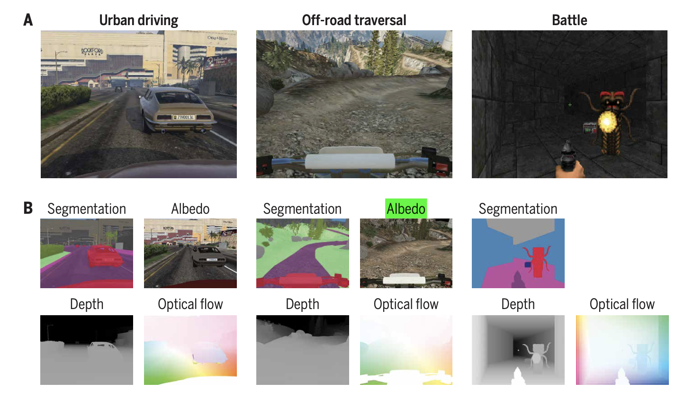

# 研究方向survey

1. 针对静态物体  主动感知 （可在地面静止平台、无人机平台）
2. 针对动态物体  感知+决策
3. 模仿学习方式解决 

## 《Does computer vision matter for action?》

Zhou et al., Sci. Robot. 4, eaaw6661 (2019) 22 May 2019

Intel Labs, Santa Clara, CA, USA. 2University of Texas at Austin, Austin, TX, USA.

**Motivation:** models can be trained to **map raw visual input directly to action**. To these we compared models that received as additional input the kinds of representations that are studied in computer vision research, such as **semantic label maps, depth maps, and optical flow.**

**Result:**

Specifically, depth estimation and semantic scene segmen- tation provided the highest boost in task performance.

However, when we tested **generalization to new areas,** the image-and-vision agent **outperformed **the image-only agent on the test set even with an order of mag- nitude less experience with the task during training.

## Emergence of exploratory look-around behaviors through active observation completion

Ramakrishnan et al., Sci. Robot. 4, eaaw6326 (2019) 15 May 2019

University of Texas at Austin, Austin, 23

Facebook AI Research, Austin, TX, USA

**Abstract:** We address the problem of **learning to look around**: How can an agent learn to acquire informative visual observations? We propose a **reinforcement learning** solution, where the agent is rewarded for reducing its **uncertainty about the unobserved portions of its environment. **

## 《Trends and challenges in robot manipulation》机器人操作的发展趋势与挑战

这是一篇发表在2019年6月《Science》杂志上的论文，本文翻译了其中的主要内容（部分内容有删减），由于本人水平有限，有翻译或理解不对之处请指正。这是一篇综述性文章，笔者希望通过翻译此文了解该领域的发展现状。

原文作者为Aude Billard 和 Danica Kragic，两位都是当下杰出的人工智能、机器人领域的女性科学家。Aude Billard教授来自瑞士洛桑联邦理工学院，Danica Kragic教授来自瑞典皇家理工学院。

### 前言

想想看，当我们回家开门的时候，你会做哪些动作？首先应该从包里找到钥匙，然后把钥匙拿在手上，同时调整好钥匙与门锁之间的角度，接着将钥匙准确插入门锁中，最后用力旋转钥匙。这一系列动作，对于我们而言易如反掌。因此，我们很少思考手、手指在日常生活中发挥的作用，也不记得小时候是如何习得这些操作的技能。直到我们想让机器人也学会这些动作的时候，才会由衷感叹人类的双手是如此灵巧和复杂。

科学研究表明，婴儿在出生后只会一些简单的抓取操作，3岁的幼儿可以控制每个手指头的使用，6岁的孩子才会掌握大多数成人会的操作技能。那么，我们到底是如何学会这些操作技能的？一种重要的方式是通过学习他人的示范，比如擦桌子。我们很少会跟小孩子说，要用多大的力抓握毛巾，擦桌子的角度和手法是什么。我们只需做一个示范，让孩子观察便可，他们通过实践，自然就学会了。

### 当今的机器人会哪些操作？

当今的机器人擅长一些重复性的、环境设定比较简单的、不确定度小的操作，即操作对象大多数是刚性的，其几何特性、材质、重量都是预先已知的。以前的操作手（臂）的轨迹是固定的，如今机器人已经可以随着操作对象调整自身的姿态，比如抓取传送带上的物体。但是，抓取运动的或者被遮挡的物体目前还是个挑战。

同时，面对多种材质的物体、不同目的的抓取任务，目前的操作手还难以应对，仅通过改变抓取手，不停调整抓取算法是低效的。

### 当今的机器人还不会哪些操作？

目前，机器人还不擅长操作一些柔性物体，如姿态、形状会不断变化的物体，像叠衣服，切菜等等操作任务，因为这需要对物体的形变构建精确的物理模型。一种解决方法是增加更多的灵巧手，当然如何协调这些手的运动又是一个难题。

未来的机器人应该有更佳的感知和操作能力，知道自己在哪里，自己的姿态，操作对象的姿态，如何操作等等。

### 设计一个灵巧手的困难在哪里？

人类的双手足够灵巧，我们当然希望设计出似人化的手。然而，这相当有挑战性。第一个挑战是在一个有限的空间里放置所有的执行器、传感器、机械结构。第二是设计的手要轻巧，否则给机械臂带来了过大的负荷。目前一个趋势是设计柔性手(Soft hands)，因为和刚性手相比，它可以根据操作对象改变姿态，且在操作时不易损坏操作对象。很多灵巧手的制作是通过3D打印实现的。下图是一些灵巧手的设计。

人类的皮肤可以高频、高分辨率地感受到操作时的受力情况、操作对象的弹性、温度等等，这些信息对于抓取等操作任务是非常关键的。为了让机器手也具备这些能力，需要在手指的顶端配备许多的受力传感器。但是这些受力传感器的不足是很难定位精确的手-物接触点。对于不同的操作任务，操作手与物之间应该有不同的接触位置，但受力传感器还不知道这些接触位置信息。当下，很多触觉传感器已经商业化，且能提供多种接触力、物体的表面材质、温度等信息。这些软体的触觉传感器需要放置在各个关节、连接点处，如下图的右图像。因此灵活的、有弹性的皮肤也需要加快研究。还有一种思路是用视觉信息判断接触点位置。首先可以建立动态的受力模型，如下图左所示。其次可以拍摄操作对象的受力变化过程进行分析。这其中的一个重要应用就是实时检测物体是否会从手中滑落，这对基于vision的方法来说，如何在有限的计算代价下实时检测是一件难事。

### 设计非似人化的手

对于很多操作任务，未必要设计一个同人类一样的五指手。许多二指、三指手也可以胜任许多操作任务。我们还可以借鉴其他动物的操作过程，如鱼在捕猎时靠嘴的吸吮，因此在水下的操作过程，可以考虑加入一些吸吮的功能。另外，人类的五个指头是不对称的，而一些任务对于对称手来说会更加简单，如下图所示的任务。

### 下一代手的设计

首先，手和臂需要一起考虑设计，手能够装到不同的操作臂平台，做到“plug-and-play"，即插即用。同时我们的手需要感知更多的接触点和接触力。其次，目前工业抓手需要抓起高负载的物体，因此大多安插在地上，这样的布置不适用于非工业场景。最后，要提高灵巧操作的感知和控制算法。

### 面向操作的感知

如下图所示，面向操作的感知是需要融合多模态信息的。**视觉**用来定位和识别目标（已知和未知的物体），这些信息对于抓手的放置，力量的分配都至关重要。**本体运动信息**感知能力也是必不可少的，机器人需要知道自己的手、手臂在什么位置，什么样的姿态。**触觉和接触力**感知是用来理解抓握时手与物之间的状态，同时也可以推断物体的属性、刚度、分布位置等信息。**听觉**信息可以判断物体的容量，例如判断一盒牛奶的体积。

近年来，视觉感知是研究最多的，但是机器人仍**难以识别被遮挡的物体**，尤其是**依靠运动相机进行识别**或**手中的物体在运动时**。相比较于视觉算法的研究，触觉信息的研究少了许多，特别是多指头的触觉传感器信息的融合、理解的研究尤其少。当下，视觉和触觉信息通常分两个阶段运用，一是在准备阶段利用视觉检测、识别物体，二是在操作阶段利用触觉信息分析受力情况。当前只有少量的工作开始将这两种模态的信息进行融合。对于人类而言，我们可以轻松处理不同模态信息。对于机器人来说，他们还无法知晓该用什么传感器，什么时候用，如何切换不同的传感器。

### 抓取：关键一步

在机器人操作中，抓取是其中的一项基础又关键的动作。在过去几十年间，研究人员为了实现稳定抓取的目的，通过构建数学和物理模型设计抓手的结构。该做法的前提是已知抓取对象的三维模型、抓取过程只有较少的不确定信息、接触点是稳固的。

因此，为了适应动态的抓取过程，避免构建一个复杂的、机械的模型，许多研究者开始使用**数据驱动(data-driven)**的方法。这种方法首先构建一个抓取数据集，通过训练的方式让机器人学会抓取。他们期望机器人通过训练学会一种泛化性较好的抓取技能，可以抓取在训练集中没有见过的抓取任务和抓取对象。当然，获取这种泛化性是不容易的。

### 从抓取到操作

抓取并不是最终目的。抓取与操作的任务密切相关。例如，同样是抓取一个杯子，有的是为了喝杯中的饮料，有的是为了端详这个杯子，有的是为了把它放到别的地方，有的是为了把它交给其他人。针对上述不同的任务，抓取杯子的方式是不同的，如下图所示。因此，**机器人应当理解抓取的意图**。

不同的操作任务需要不同的操作工具，如果机器人身边没有合适的工具（比如某个任务需要一个锤子），那么机器人应当寻找一个**替代的物体**（比如找一个坚固的东西替代锤子）。这个过程需要机器人具备一定的**推理能力**，或者说具备一定的common sense，当下已经有一些工作开始了这方面的研究。

### 操作--依旧困难

机器人目前可以做一些简单的操作行为，比如丢、滑、戳、旋转、推等。当这些任务在一个真实的自然环境下实施时，或者需要与人或物密切接触时，任务难度马上又会增加。比如，让机器人去书架上取下若干本书，且不破坏原来书摆放的方式。当下，研究者认为感知与控制应当是紧密结合的，有的研究将操作认为是感知的一种手段，感知是为了更好的操作。

当操作对象不断变化时，这样的操作是很有挑战性的，如切菜。因为这需要构建操作对象形变的模型，同时要有更高级的感知能力察觉到物体的变化，比如当我们拧一个瓶盖时，需要让手感受到摩擦力不断减小的过程。如何建模这种摩擦力的变化过程仍然是一个挑战。

在手(In-hand)操作也很复杂，下图所示，比如在手上旋转一只笔，调整钥匙的姿态以将其插入门锁中。在手操作由一系列的抓取、滑动、旋转等动作组成，当然还包括两只手之间的协调运作。 在机器人的高级操作中，通常会定义固有和外在的灵巧操作能力。固有灵巧操作指充分利用手部已有的自由度。高级的固有灵巧操作希望能模仿人体操作手。外部灵巧操作能力是指凭借外部力量的支持，用以弥补内部缺失的一些自由度。比如可以通过改变摩擦力，重力，接触力等。

还有一个尚待研究的领域是双手（臂）操作。在这个领域，一些工作开始关注如何融合目标的表示信息，如何定义简单的目标运动，如何去建立双手操作的模型。这个领域在未来一定会有更多的有贡献的工作，因为当今大多数拟人机器人都有双手操作能力。这类操作不光是要求对手的控制，还需要对臂、躯干等有较好的控制，就像下图的机器人一样，这看起来就更加困难了。如果再让机器人具备推理能力，这听起来就有点疯狂了。

### 基于学习的操作

人类的操作技能大多是通过后天学习得到的。我们希望机器人也能通过后天的练习学会这些技能。

基于学习的方法仍然存在以下一些挑战：缺少准确的物体物理模型，缺少动态接触过程的模型，自由度增加带来的控制难题。当下的方法更多依赖于学习策略而不是控制策略。例如，基于学习的方法可以在某个隐层空间表达稳定和不稳定的抓取行为，这就可以将其泛化到其他的场景，比如当抓取不当时，可以快速调整抓取动作。基于学习的方法可以表示抓取、操作的动力学特性（在一些隐层空间），如建立力接触模型，这可以显著减少控制的维度。

尽管如此，不是所有问题都是靠学习来解决的。基于学习的方法也有其局限性。首先，为了学习需要构建大量数据，然后让机器人不断试错。这个过程是很枯燥的，而且容易损坏机器人。目前一个趋势是在仿真环境下训练机器人操作算法，然后在实际平台上微调这些算法。当然这需要构建一个逼真的仿真环境。有一个方式是让机器人**从互联网上下载的视频或图像**中学习，或者向一个**真实的专家**学习，通常是一个人。当然，在一些危险或者极端的环境下，没有专家可以做示范教学。所以，尽管基于学习的方法很重要，但是在机器人学中，它不是每个问题的答案。

### 展望未来

首先，基础理论仍然需要研究。针对软接触需要构建相应的模型；构建物体姿态发生变化的模型（如黄瓜被切后的模型，洋葱被剥后的模型）。一个完整的操作过程可能有许多个中间动作，这就要求将规划也一并纳入操作过程。我们还需要更逼真的仿真环境，包括机器人和场景。

接着，硬件设备也需要加紧开发。比如研发出更接近人皮肤的传感器，它们不需要背负很多的电缆。为了实现在手操作，我们需要一种可以高频操作的末端执行器，而且在不同的介质中（空气，水，油）不易受损。 当然，这些硬件最好是便宜的，稳定的，轻巧的，容易装配的。

最后，考虑到人机交互时，应确保人的安全。这需要机器人能理解人的行为，且机器人的设计要考虑安全性。

人的行为方式是机器人研发的主要灵感来源，反过来通过设计和开发机器人，我们也可以更好地理解人和人的行为。

**Unfamiliar words:**

Dexterous manipulation 灵巧操作

Proxy 代理

Be akin to  = be similar to 

suffice for 足够

actuators 执行器、制动器

aesthetic 审美的

be devoid of 没有什么...

sturdy坚固的

a major hurdle 障碍

**well-written sentences:**

-Dexterous manipulation is one of the primary goals in robotics. 

-Over the past decade, research **has made strides toward these goals. **

-**Progress has come from advances in** visual and haptic perception **and in** mechanics.

-**Most notably, immense progress** in machine learning has been **leveraged to** encapsulate models of uncertainty and to support improvements in adaptive and robust control.

-Although robotics **has made vast progress in** mechanical design, perception, and robust control targeted to grasping and handling objects, robotic manipulation is **still a poor proxy for** human dexterity.

-Although research on robot hands **has been on-going for more than five decades** (2–4), **the most common hand used in many applications to date** is still a parallel jaw gripper.

-This tool may **suffice for** simple pick-and-place actions, **but not for** more-complex motions such as shuffling keys.  足够做...仍不够做..

-Industrial arms have **substantial payloads** but are commonly designed to **be bolted into** the floor and are too large to be deployed outside industrial settings.   bolt插销

-**Fences that** used to **separate** humans **from** robots will **disappear gradually.**

-Human ways of acting will continue to serve as inspiration for future robot systems, and robots will serve as a tool for better understanding humans.

